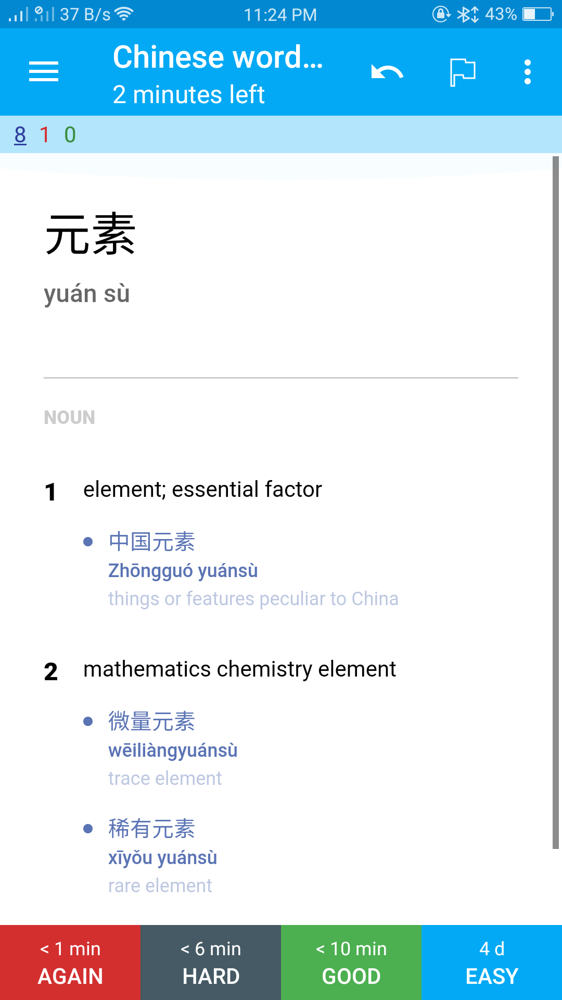

# pleco_to_anki

A simple script to format pleco flashcard exports and convert it into an anki package

## Usage

You have to use python to run this script. Install the requirements with pip install -r requirements.txt

Export the flashcards you want from pleco (menu > import/export > export cards). Set the format to text file and character set to simplified, and check 'card definitions' and 'dictionary definitions'. Transfer the exported file to your computer

Then, in this directory run `python3 ./pleco_to_anki <path_to_pleco_file> <deck_name>`. A .apkg file should be generated in this directory and you can install it by opening anki and going to File > Import > select the file

## Problems

This software was made hastily for personal use, so there are quite a few bugs, primarily definition parsing issues
